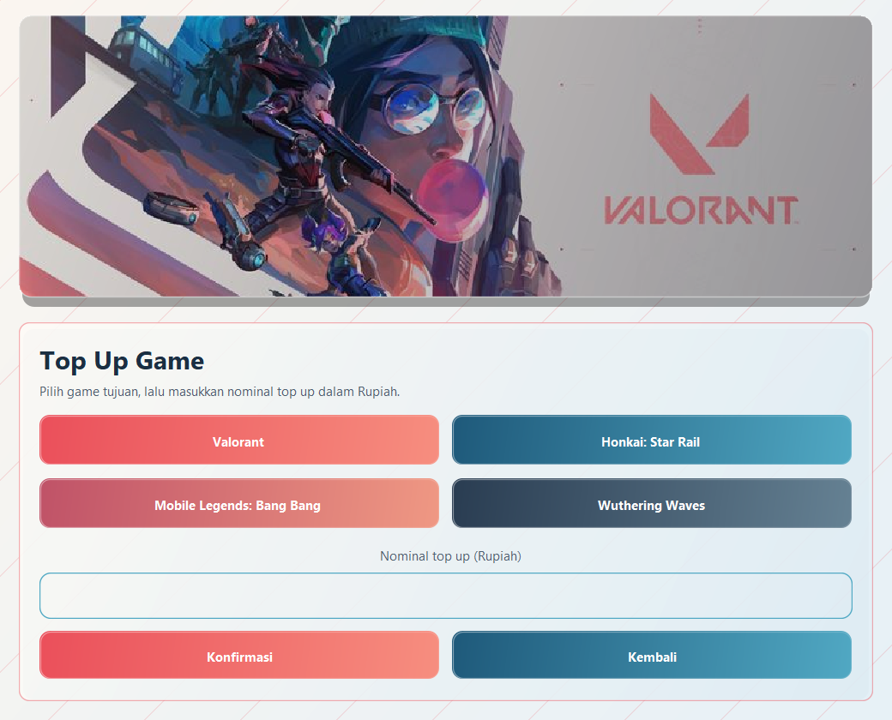

# Mambo Store - Java GUI Top Up

Aplikasi desktop Java Swing untuk simulasi transaksi top up game, pulsa, dan e-money dengan antarmuka modern, kalkulasi biaya otomatis, serta sistem pembayaran QRIS dan Virtual Account.

## Fitur

- **Top Up Game**: Valorant, Honkai: Star Rail, Mobile Legends, Wuthering Waves (konversi kurs otomatis).
- **Top Up Pulsa**: Telkomsel, Axis, Tri, XL, Smartfren.
- **Top Up E-Money**: GoPay, DANA, OVO, ShopeePay.
- **Pembayaran**: QRIS dinamis (ZXing QR generator) dan Virtual Account (BCA, Mandiri, BNI, BRI).
- **Validasi**: Pengecekan input nominal, format nomor tujuan, dan ID akun.

## Tampilan

### Main Window


### Top Up Game


### Pulsa & E-Money


## Aturan Transaksi

| Kategori | Min. Nominal | Biaya Admin |
| :--- | :--- | :--- |
| **Game** | Bebas | Disesuaikan dengan kurs game |
| **Pulsa** | Rp 5.000 | Rp 500 (+ Rp 500 per kelipatan Rp 50.000) |
| **E-Money** | Rp 10.000 | Rp 1.500 (+ Rp 1.500 per kelipatan Rp 100.000) |

## Struktur Proyek

```text
Colej-GroupProject/
├── .vscode/                 # Konfigurasi workspace VS Code
├── lib/                     # Library ZXing (offline build)
├── src/main/
│   ├── java/                # Source code aplikasi
│   └── resources/assets/    # Gambar & banner UI
├── docs/screenshots/        # Dokumentasi visual
├── build.gradle             # Konfigurasi Gradle
├── pom.xml                  # Konfigurasi Maven
└── README.md
```

## Cara Menjalankan

### 1. Command Line

**Gradle Wrapper (Disarankan):**
```bash
./gradlew run
```
*Windows:* `.\gradlew.bat run`

*Catatan untuk pengguna Linux Wayland (Niri/Sway/Hyprland): flag `_JAVA_AWT_WM_NONREPARENTING=1` sudah dikonfigurasi otomatis di `build.gradle`.*

**Maven:**
```bash
mvn compile exec:java
```

**Direct Java:**
```bash
mkdir -p build/classes
javac -d build/classes -cp "lib/*" src/main/java/*.java
cp -r src/main/resources/* build/classes/
java -cp "build/classes:lib/*" MainWindow
```

### 2. IDE (VS Code, IntelliJ IDEA, Eclipse, NetBeans)

- **VS Code**: Buka folder proyek, buka `src/main/java/MainWindow.java`, tekan `F5` atau klik tombol **Run**.
- **IntelliJ / Eclipse / NetBeans**: Buka folder proyek (terdeteksi otomatis via Gradle/Maven), jalankan `MainWindow.java`.

## Kebutuhan Sistem

- JDK 17 atau lebih baru
